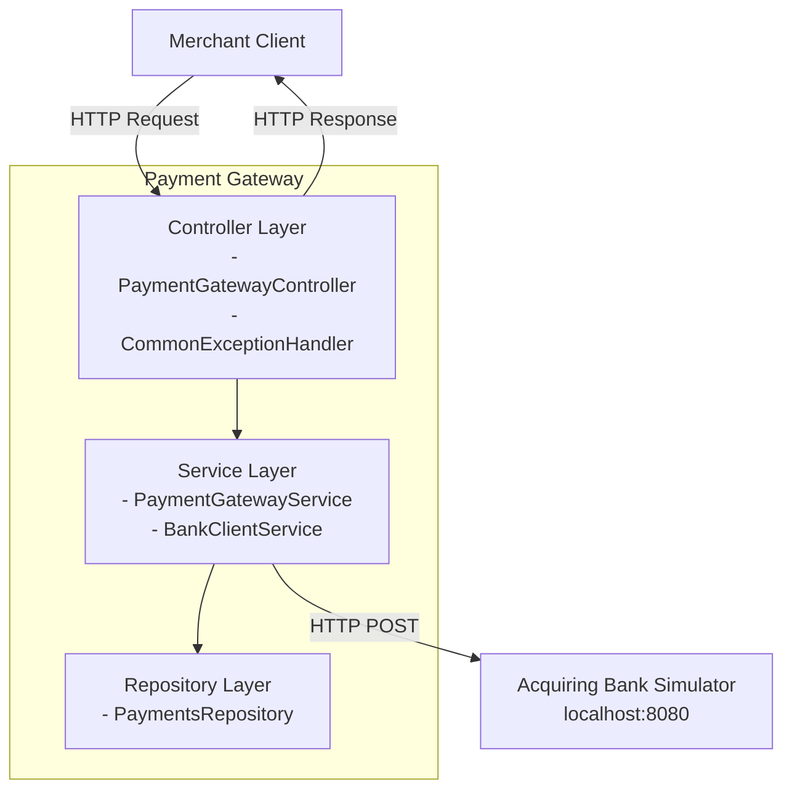
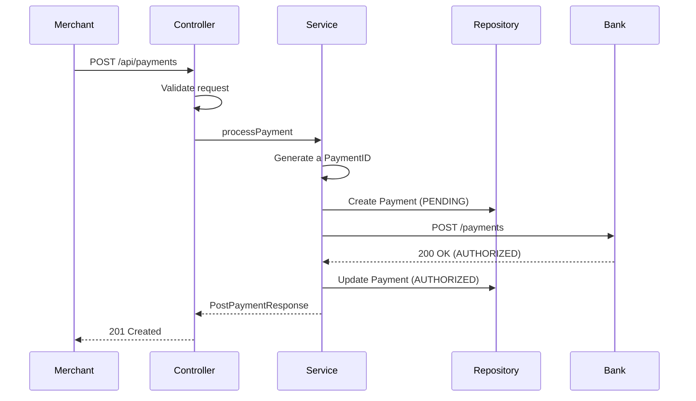
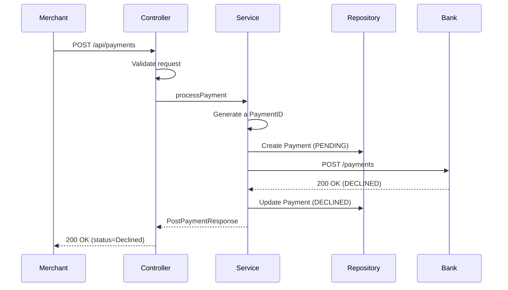
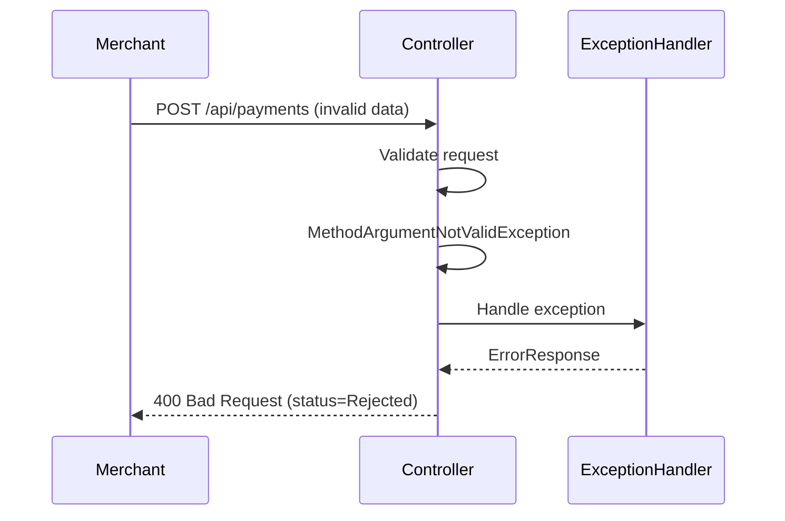
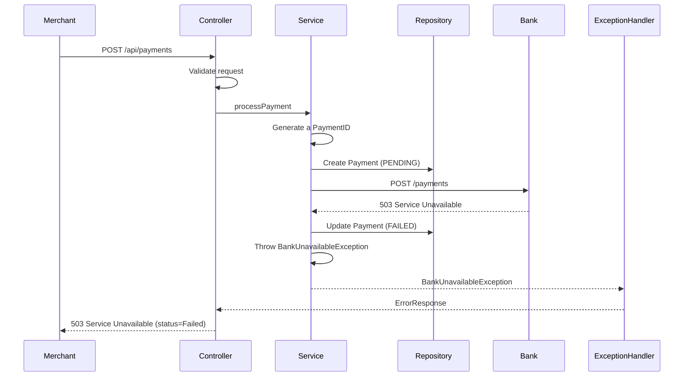
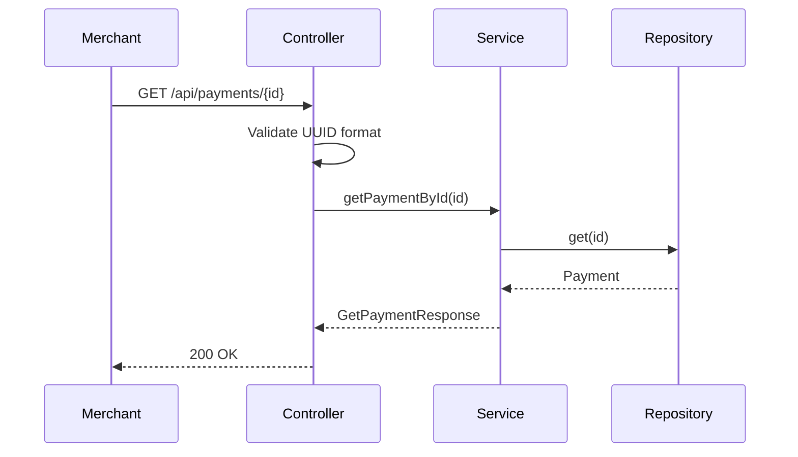
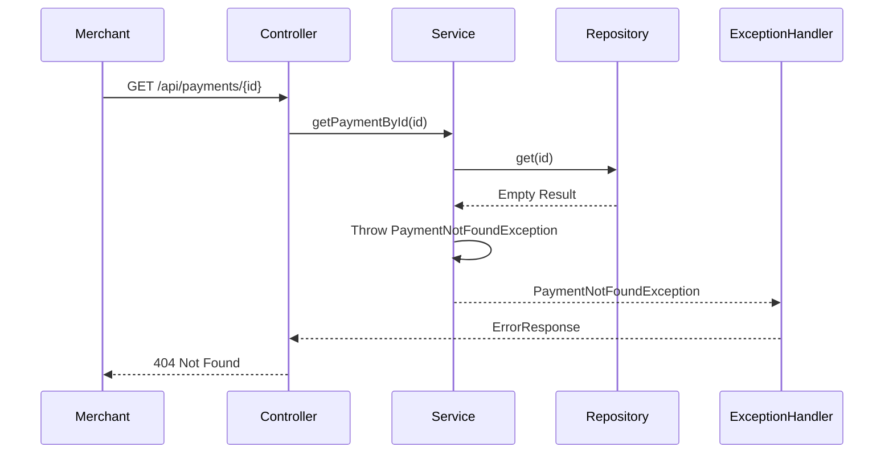

# Payment Gateway Design Document

A Payment Gateway enables merchants to process card payments and retrieve payment details. The gateway validates requests, forwards valid payments to an acquiring bank, and stores payment records with masked card information.

---

## 1. Requirements

### 2.1 Functional Requirements

1. A merchant should be able to process a payment through the payment gateway and receive one of the following types of response:
   - Authorized - the payment was authorized by the call to the acquiring bank
   - Declined - the payment was declined by the call to the acquiring bank
   - Rejected - No payment could be created as invalid information was supplied to the payment gateway and therefore it has rejected the request without calling the acquiring bank

2. A merchant should be able to retrieve the details of a previously made payment

### 2.2 Out of Scope

- Non-Functional Requirements: Consistency, Scalability, Reliability, etc
- AuthN and AuthZ
- Idempotency
- Async processing and notification
- Payment Refunds

---

## 3. Data Models and API Schemas

### 3.1 Payment Request


| Field        | Validation rules                     | Notes                                                                                                                                                                               |
|--------------|--------------------------------------|-------------------------------------------------------------------------------------------------------------------------------------------------------------------------------------|
| Card number  | Required                             |                                                                                                                                                                                     |
|              | Between 14-19 characters long        |                                                                                                                                                                                     |
|              | Must only contain numeric characters |                                                                                                                                                                                     |
| Expiry month | Required                             |                                                                                                                                                                                     |
|              | Value must be between 1-12           |                                                                                                                                                                                     |
| Expiry year  | Required                             |                                                                                                                                                                                     |
|              | Value must be in the future          | Ensure the combination of expiry month + year is in the future                                                                                                                      |
| Currency     | Required                             | Refer to the list of [ISO currency codes](https://www.xe.com/iso4217.php). Ensure your submission validates against no more than 3 currency codes                                   |
|              | Must be 3 characters                 |                                                                                                                                                                                     |
| Amount       | Required                             | Represents the amount in the minor currency unit. For example, if the currency was USD then <ul><li>$0.01 would be supplied as 1</li><li>$10.50 would be supplied as 1050</li></ul> |
|              | Must be an integer                   |                                                                                                                                                                                     |
| CVV          | Required                             |                                                                                                                                                                                     |
|              | Must be 3-4 characters long          |                                                                                                                                                                                     |
|              | Must only contain numeric characters |                                                                                                                                                                                     |


One example payload:
```json
{
  "card_number": "4111111111111111",
  "expiry_month": 12,
  "expiry_year": 2025,
  "currency": "USD",
  "amount": 1050,
  "cvv": "123"
}
```

### 3.2 Payment Response (Authorized/Declined)


| Field                 | Notes                                                                                                                                                                               |
|-----------------------|-------------------------------------------------------------------------------------------------------------------------------------------------------------------------------------|
| Id                    | This is the payment id which will be used to retrieve the payment details. Feel free to choose whatever format you think makes most sense e.g. a GUID is fine                       |
| Status                | Must be one of the following values `Authorized`, `Declined`                                                                                                                        |
| Last four card digits | Payment gateways cannot return a full card number as this is a serious compliance risk. However, it is fine to return the last four digits of a card                                |
| Expiry month          |                                                                                                                                                                                     |
| Expiry year           |                                                                                                                                                                                     |
| Currency              | Refer to the list of [ISO currency codes](https://www.xe.com/iso4217.php). Ensure your submission validates against no more than 3 currency codes                                   |
|                       |                                                                                                                                                                                     |
| Amount                | Represents the amount in the minor currency unit. For example, if the currency was USD then <ul><li>$0.01 would be supplied as 1</li><li>$10.50 would be supplied as 1050</li></ul> |

One example payload:
```json
{
  "id": "f47ac10b-58cc-4372-a567-0e02b2c3d479",
  "status": "Authorized",
  "last_four_card_digits": "1111",
  "expiry_month": 12,
  "expiry_year": 2025,
  "currency": "USD",
  "amount": 1050
}
```

Rejected Error Response:
```json
{
  "status": "Rejected",
  "failure_reason": "validation_failed",
  "errors": [
    {
      "field": "card_number",
      "message": "Card number must be 14-19 numeric digits",
      "rejectedValue": "123"
    }
  ]
}
```

Bank Service Unavailable Response:
```json
{
  "id": "f47ac10b-58cc-4372-a567-0e02b2c3d479",
  "status": "Failed",
  "failure_reason": "bank_unavailable"
}
```

### 3.3 Bank API

**Bank Request**:
```json
{
  "card_number": "4111111111111111",
  "expiry_date": "12/2025",
  "currency": "USD",
  "amount": 1050,
  "cvv": "123"
}
```

**Bank Response**:
```json
{
  "authorized": true,
  "authorization_code": "0bb07405-6d44-4b50-a14f-7ae0beff13ad"
}
```

### 3.4 Internal Domain Model

**Payment Entity** (stored in repository):
- `id`: UUID
- `status`: AUTHORIZED or DECLINED or FAILED
- `lastFourCardDigits`: String (4 digits only)
- `expiryMonth`: Integer
- `expiryYear`: Integer
- `currency`: String
- `amount`: Integer
- `authorizationCode`: String (from bank)
- `createdAt`: LocalDateTime

**Note**: Full card number and CVV are NEVER stored.

---

## 4. High-Level Architecture

### 4.1 Layered Architecture



### 4.2 Component Responsibilities

**Controller Layer**:
- HTTP request/response handling
- Request validation
- Exception handling

**Service Layer**:
- Business logic orchestration
- Payment creation and retrieval
- Bank API integration

**Repository Layer**:
- Payment persistence and retrieval

---

## 5. API Design

### 5.1 POST /api/payments - Process Payment

**Endpoint**: `POST /api/payments`

#### 5.1.1 Request Validators

- Basic field validation: see request model definition
- Custom validator: 
  - ValidExpireDate: ensure (expiry_month, expiry_year) is in the future

#### 5.1.2 API Processes

**Case 1: Authorized Payment**



**Case 2: Declined Payment**



**Case 3: Validation Failure (Rejected)**



**Case 4: Bank Unavailable**



#### 5.1.3 Error Handling Strategy

| Scenario                     | HTTP Status | Response Status | Storage | Bank Called |
|------------------------------|-------------|-----------------|---------|-------------|
| **Validation fails**         | 400         | Rejected        | No      | No |
| **Bank authorizes**          | 201         | Authorized      | Yes     | Yes |
| **Bank declines**            | 200         | Declined        | Yes     | Yes |
| **Bank service unavailable** | 502         | Falied          | Yes     | Yes (failed) |

#### 5.1.4 Security Concerns

- Never store or log **card_number** and **cvv**

---

### 5.2 GET /api/payments/{id} - Retrieve Payment

**Endpoint**: `GET /api/payments/{id}`

#### 5.2.1 Validators

- Path parameter `{id}` must be valid UUID format, otherwise returns 400 if invalid

#### 5.2.2 API Processes

**Case 1: Payment Found**



**Case 2: Payment Not Found**



#### 5.2.3 Error Handling

| Scenario | HTTP Status | Description |
|----------|-------------|-------------|
| Payment found | 200 | Return payment details |
| Payment not found | 404 | Payment ID doesn't exist |
| Invalid UUID format | 400 | Malformed UUID string |

---

## 6. Testing 

- Unit testing for each component
- Integration testing with mocked bank responses
- E2E testing with bank simulator
  - POST Payment
    - Happy Path: authorized payment
    - Declined Payment from Bank
    - Validation Error: returns 400 Bad Request
    - Bank 503 Service Unavailable: returns Failed with failure_reason
  - Get Payment
    - Happy Path: get an authorized/declined/failed payment
    - Payment not Found: returns 404 Not Found error

---

## 7. Observability and Monitoring

TODO: Logs + Metrics + Alerts

# Appendix

Build and Testing
- Start bank simulator: `docker-compose up`
- Build: `./gradlew build`
- Run tests: `./gradlew test`
- Swagger: http://localhost:8081/swagger-ui.html
- Bank: http://localhost:8080/payments

## Development Tasks
- [x] POST Payment Request and Validations
- [x] BankClient
- [X] Integrate BankClient in POST Payment, handle Authorized, Declined, Failed cases
- [X] Get Payment
- [ ] Integration Testing